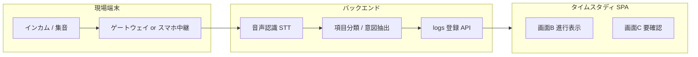
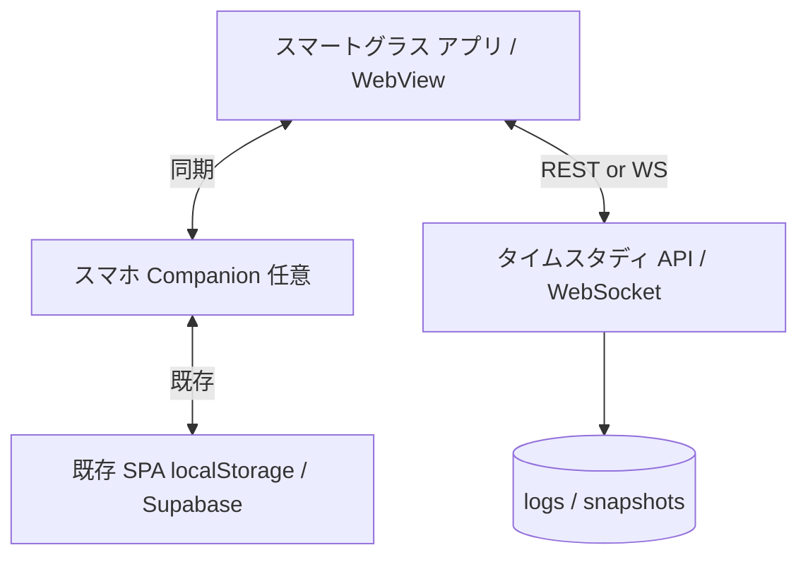

# 介護タイムスタディアプリ 設計メモ

本ドキュメントは実装仕様書ではなく、**現状の方向性と将来拡張の設計メモ**です。  
ユーザー向けの機能説明は `アプリ機能紹介.md` を参照してください。

---

## 1. システム概要（現状）

| 項目 | 内容 |
|------|------|
| 形態 | ブラウザ SPA（React + Vite + TypeScript） |
| 主用途 | 介護現場のタイムスタディ記録 → 10分グリッド検証 → 公式 Excel 出力 |
| 永続化 | `localStorage`（標準）、Supabase スナップショット（任意） |
| 分析 | 画面D: ワークフロークラスター分析（DX改善候補） |
| API 土台 | Drizzle（Postgres スキーマ）、Hono `/api/logs`（フロント未接続） |

### 画面とコンポーネントの対応

| UIタブ | 画面名 | コンポーネント |
|--------|--------|----------------|
| A | 設定 | `SettingsScreenC` |
| B | ログ入力 | `InputScreenA` |
| C | 提出チェック | `SheetScreenB` |
| D | DX改善提案 | `AnalysisScreenD` |

---

## 2. データモデル（現状・拡張の前提）

### 2.1 コアエンティティ

- **logs**: 職員・介助項目・開始/終了時刻・メモ・解析未完了フラグ（`is_pending`）
- **manualGridValues**: 画面Cでの10分セル手修正（キー: 行×列）
- **設定**: 職員マスタ、勤務時間帯、出力メタ（施設・ユニット・職員ID・調査日など）

### 2.2 入力ソースの拡張（将来）

現状は **タップ操作（画面B）** と **手入力グリッド（画面C）** が主。  
今後は入力経路を増やしても、最終的には同じ `logs` / 10分グリッド / Excel 出力パイプラインに収束させる。

| `source`（案） | 説明 |
|----------------|------|
| `tap` | 現行の項目ボタン・切替記録 |
| `manual_grid` | 画面Cのセル補正（画面D分析でも利用中） |
| `voice_intercom` | インカム経由の音声→テキスト→項目分類 |
| `voice_smart_glass` | スマートグラス経由の音声／ジェスチャー |
| `voice_phone` | スマホマイク（Whisper 等、既存設計メモ） |

---

## 3. 既存の将来計画（音声・バックエンド）

`アプリ構成.md`（旧 RTF）に記載していた方針を Markdown 上で整理する。

### 3.1 音声入力（スマホマイク）

1. Whisper API で音声→テキスト
2. Gemini（等）でテキストを介助項目 1〜24 に分類
3. 分類不能時は `is_pending: true` とし、画面Cの要確認キューへ
4. 「その他」項目は **テキストメモをそのまま残す**（取りこぼし防止）

### 3.2 バックエンド

- Cloudflare Workers（Hono）+ Neon DB 等への移行検討
- ログの正規化保存・マルチ端末同期・監査ログ
- 本番では認証・テナント（施設ID）分離・RLS 厳格化（`VERCEL_SUPABASE_SETUP.md` 参照）

---

## 4. 今後の展望：インカム対応

### 4.1 目的

介護現場では **両手が塞がったまま** 業務が続くため、スマホ操作より **インカム（ワイヤレスインターカム）での発話記録** が自然な入力経路になる。  
「今何をしているか」を口頭で報告し、アプリ側でタイムスタディログに変換する。

### 4.2 想定ユースケース

- シフト中、移動・介助の切り替え時に短いフレーズで報告（例:「排泄介助、101号室」）
- 間接業務の開始・終了（例:「記録始める」「記録終わった」）
- 想定外業務は「その他」＋内容を音声メモとして保持
- 複数職員が同一チャンネルを使う施設では、**話者識別** または **端末紐づけ** で職員を特定

### 4.3 アーキテクチャ案



- **リアルタイム性**: 完全ストリーミングより、まずは **発話区間の切り出し → バッチ STT** で十分な場合が多い（コスト・精度のバランス）
- **既存 UI との関係**: 画面Bは「現在の項目・経過時間」を **読み上げまたはミニマル表示** で確認用に。確定操作はサーバー側の自動区切り＋要確認キュー

### 4.4 機能要件（案）

| 区分 | 内容 |
|------|------|
| 必須（初期） | 発話→テキスト→項目候補の提示、確信度低は `is_pending`、原文 `memo` 保持 |
| 必須（初期） | 項目切替フレーズの辞書（施設・現場用語のカスタム） |
| 推奨 | PTT（プッシュ・トーク）連携：押している間だけ録音（プライバシー・誤拾音対策） |
| 推奨 | オフラインキュー：ネット不通時は端末に蓄積し、復帰後に同期 |
| 将来 | 話者分離（diarization）で複数職員チャンネル対応 |
| 将来 | インカムベンダー API（チャンネル・端末ID）との直接連携 |

### 4.5 非機能・運用

- **個人情報**: 利用者名・部屋番号が音声に含まれる前提で、保存期間・マスキング方針を施設ポリシーに合わせる
- **騒音環境**: 認識率低下時は画面Cで人手修正する前提を明示（現行の品質チェックフローと整合）
- **監査**: `source: voice_intercom`、生テキスト、分類結果、確信度をログに残す

---

## 5. 今後の展望：スマートグラス対応

### 5.1 目的

スマートグラスは **視線を利用者に向けたまま**、現在の業務項目と経過時間を確認し、**音声またはジェスチャー** で記録できる入力端末になる。  
インカムと組み合わせると「聞く（報告）＋見る（状態確認）」のハンズフリー運用が可能。

### 5.2 想定ユースケース

- ヘッドアップ表示: 進行中項目名、経過分、長時間警告
- 音声コマンド: 「次は食事支援」「終了」→ 項目切替（画面Bと同等の状態機械）
- 要確認バッジ: `is_pending` 件数をグラス上に表示し、休憩時にスマホ／PCで画面Cへ
- 双方向ではなく **片方向の軽量 UI** から開始（バッテリー・開発コスト抑制）

### 5.3 アーキテクチャ案



- **Phase 1**: スマホ Companion がマスター、グラスは **ミラー表示＋音声をスマホに転送**（デバイス SDK 差異を吸収）
- **Phase 2**: グラス単体で STT＋分類（端末上 or エッジ）→ API 直接投稿
- **Phase 3**: 視線・ジェスチャー（デバイス依存）で項目プリセット選択

### 5.4 機能要件（案）

| 区分 | 内容 |
|------|------|
| 必須（初期） | 進行中ログの表示（職員・項目・開始・経過） |
| 必須（初期） | 音声による「開始／切替／終了」コマンド（インカムと共通の意図抽出層） |
| 推奨 | オフライン時のローカルキュー＋Companion 経由同期 |
| 推奨 | 画面Bと同一の事故防止（記録中の誤タブ相当操作の禁止） |
| 将来 | デバイス別 SDK（RealWear / Vuzix / Android XR 等）の抽象化レイヤー |
| 将来 | 利用者居室でのカメラ非搭載・表示のみモード（プライバシー配慮） |

### 5.5 UI・UX 方針

- 情報量は **1画面1〜2行** に抑える（視認負荷・安全）
- 色は画面Cのバリデーション色と意味を揃える（赤＝要確認、など）
- 長時間業務警告はインカム読み上げとグラス表示の両方で通知可能に

---

## 6. インカム × スマートグラス × 既存 SPA の統合方針

### 6.1 共通の「記録状態機械」

タップ・音声・グラス操作はすべて、次の状態遷移を共有する。

1. アイドル（未記録）
2. 進行中（`inProgress`: 職員・項目・開始時刻）
3. 区切り確定 → `logs` へ追記
4. 分類不明 → `is_pending: true` で登録 → 画面C要確認

実装時は `InputScreenA` のロジックを **フックまたはサービス層** に抽出し、入力アダプタから呼ぶ形を推奨。

### 6.2 API 拡張（案）

```
POST /api/logs/voice-segment
  body: { staffId?, deviceId, channelId?, transcript, recordedAt, source }
  → 分類結果 + 作成/更新された logId + confidence

GET  /api/logs/in-progress?staffId=
  → グラス・インカムゲートウェイ用の軽量 JSON

WS   /api/logs/stream  (任意)
  → 進行中状態・要確認件数のプッシュ
```

### 6.3 画面との役割分担

| 端末 | 主担当 |
|------|--------|
| スマートグラス | 入力・進行確認・短いフィードバック |
| インカム | 音声入力（両手フリー） |
| スマホ／PC SPA | 設定、提出チェック、Excel 出力、DX分析 |
| 画面C | 音声・自動分類の **最終品質ゲート**（現行フローを維持） |

---

## 7. 実装フェーズ（案）

| フェーズ | 内容 | 依存 |
|----------|------|------|
| P0 | 記録状態機械の共通化、logs に `source` / `confidence` 追加 | 現行 SPA |
| P1 | スマホマイク → STT → 分類 → `is_pending` フロー | P0、バックエンド |
| P2 | インカム: PTT または区間録音 → 同一分類パイプライン | P1 |
| P3 | スマートグラス Phase1: Companion ミラー＋音声中継 | P1 |
| P4 | グラス／インカムのオフラインキュー、Supabase/API 同期統一 | P2–P3 |
| P5 | 話者識別・ベンダー API・グラス単体 STT | 運用データに基づく |

---

## 8. リスク・未決事項

- インカム機器・施設 LAN／クラウドの構成は施設ごとに異なる → **ゲートウェイ仕様の標準化** が必要
- スマートグラスは OS／SDK が分散 → Phase1 は Companion 経由に寄せる
- 音声認識の誤分類は必ず発生する → **画面Cの人手修正を公式フローに残す**
- 利用者プライバシー・録音同意・保存期間は法務・施設規程と合わせて別途定義
- リアルタイム計測と「10分セル提出形式」の整合: 区切り時刻の丸めルールを明文化する

---

## 9. 関連ドキュメント

- `アプリ機能紹介.md` — 現行機能のユーザー向け説明
- `VERCEL_SUPABASE_SETUP.md` — クラウド同期のセットアップ
- `supabase/schema.sql` / `src/db/schema.ts` — DB スキーマ（正規化・API 接続時に更新）
- `src/config/timeStudyActions.ts` — 介助項目 1〜24 定義
- `アプリ構成.md` — 旧設計メモ（RTF）。本ファイルに集約し、今後は **本 Markdown を正** とする

---

## 変更履歴

| 日付 | 内容 |
|------|------|
| 2026-06-05 | 初版作成。インカム・スマートグラスを含む今後の展望を追記。旧 RTF の音声・バックエンド方針を整理 |
